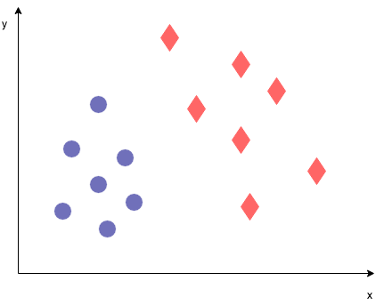
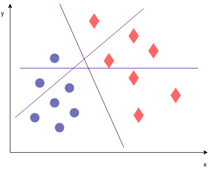
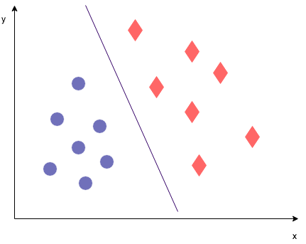
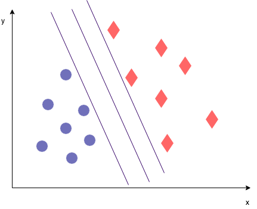
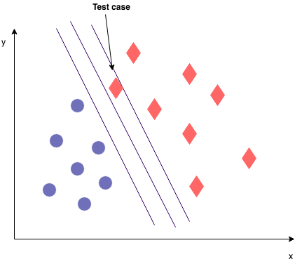
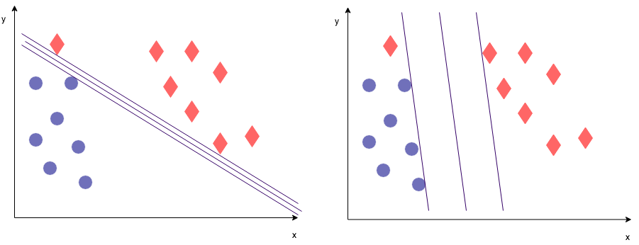

# Introduction to Support Vector Machines

## Introduction

By now you've learned a few techniques for classification: you touched upon it when talking about naive bayes, next we saw some supervised learning techniques such as logistic regression and decision trees. Now it's time for another fast and popular classification technique: Support Vector Machines.

## Objectives
- Understand what a Support Vector Machine is
- Understand the mathematical formulation of a simple soft-margin classifier
- Understand the mathematical formulation of a simple max-margin classifier

## The idea

The idea behind Support Vector Machines (also referred to as SVMs) is that we perform classification by finding the seperation line or (in higher dimensions) "hyperplane" that best differates between two classes. Because we're talking about lines and hyperplanes, it's always easiest to explain this idea by looking at a visual example.

Imagine we have a data set containing 2 classes (denoted by blue dots and and 2 features.

We want to find a hyperplane or "decision boundary" that divides one class from the other. Which one works best?

This would be a good line.

But these other ones too... How to chose the best one? Either one of these three lines (or, using generalized language "hyperplanes") does equally well at classifying. The optimization objective in SVMs however is to **maximize the margin**. So what does this mean?

The margin is defined as the distance between the separating line (hyperplane) and the training set cases that are closest to this hyperplane, which are the so-called "support vectors". The suport vectors in this particular case are highlighted in the image below. As you can see, the max margin hyperplane is right in the middle between the two lines defined by the support vectors.

## The Max Margin Classifier

Why would you bother maximizing the margins? Don't these other hyperplanes discriminate equally well? Remember that you are fitting the hyperplane on your training data. Imagine you start looking at your test data, which will slightly differ from your training data.

Assuming your test set is big enough and randomly drawn from your entire data set, you might end up with a test case as shown on the image below. This test case diverts a little bit from the training set cases observed earlier. Where the max margin classifier would classify this test set case correctly, if you would have chosen the hyperplane closer to the right, this test case would have been classified incorrectly. Of course this is just one example, and other test cases will end up in a different spot, but the purpose of chosing the max margin classifier is to minimize the generalization error when applying the model to test set data.

To get an idea of the margin maximization, let's take a closer look at the mathematical formulation of the hyperplanes defined by the support vectors. Let's look at the image again:

Some terminology: The lines defined by the support vectors are the negative (to the left) and the positive (to the right) hyperplanes respectively.

$$ b + w_Tx_{pos} =1$$

$$ b + w_Tx_{neg} =-1$$

$$ w_T(x_{pos}-x_{neg}) = 2$$

If you want to normalize it by the length of the vector $||w||$:

$$ || w ||= \sqrt{\sum^m_{j-1}w_j^2} $$

Then, divide the former expression by $||w||$. The left side of resulting equation can be interpreted as the distance between the positive and negative hyperplane. This is the **margin** we want to maximize.

$$ \dfrac{w_T(x_{pos}-x_{neg})}{\lVert w \rVert} = \dfrac{2}{\lVert w \rVert}$$

The objective of the SVM is then maximizing $\dfrac{2}{\lVert w \rVert}$ while constraining that the samples are classified correctly. Mathematically,

$ b + w_Tx^{(i)} \geq 1$  if $y ^{(i)} = 1$

$ b + w_Tx^{(i)} \leq -1$  if $y ^{(i)} = -1$

For $i= 1,\ldots ,N$

These equations basically say that all negative samples should fall on on the left side of the negative hyperplane, whereas all the positive samples should fall on the right of the positive hyperplane. This can also be written in one line as follows:

$y ^{(i)} (b + w_Tx^{(i)} )\geq 1$  for each $i$

Note that maximizing $\dfrac{2}{\lVert w \rVert}$ means we're minimizing $\lVert w \rVert$, or, as is done in practice because it seems to be easier to be minimized, $\dfrac{1}{2}\lVert w \rVert^2$.

## The Soft Margin Classifier

Introducing slack variables $\xi$. The idea for introducing slack variables is that the linear constraints need to be relaxed for data that are not linearly saparable, as not relaxing the constraints might lead to the algorithm that doesn't converge. 

$ b + w_Tx^{(i)} \geq 1-\xi^{(i)}$  if $y ^{(i)} = 1$

$ b + w_Tx^{(i)} \leq -1+\xi^{(i)}$  if $y ^{(i)} = -1$

For $i= 1,\ldots ,N$

The objective function is 

 $$\dfrac{1}{2}\lVert w \rVert^2+ C(\sum_i \xi^{(i)})$$

You're basically adding these slack variables in your objective function, making clear that you want to minimize the amount of slack you allow for. You can tune this with the C variable as well. C will define how much slack we're allowing.

- A big value for C will lead to the picture on the left: Misclassifications are heavily punished, so we'll prioritize classifying correctly over having a big margin.
- A small value for C will lead to the picture on the right: it is OK to have some misclassifications, we'd rather have a bigger margin overall. 

## Summary 

Great! You now understand what Max Margin Classifiers are as well as Soft Margin Classifiers. In the next lab, we'll try to code these fairly straightforward linear classifiers from scratch!
